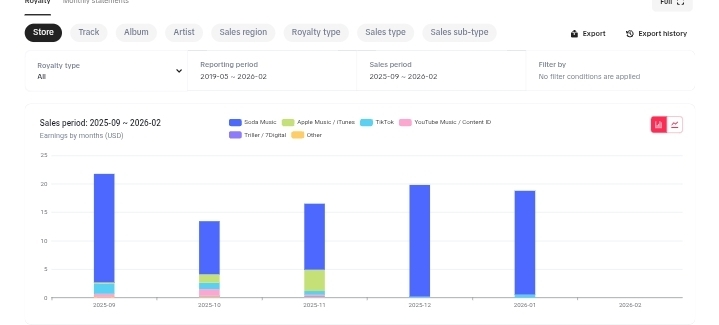
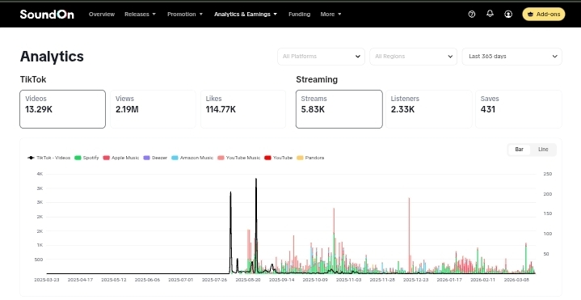
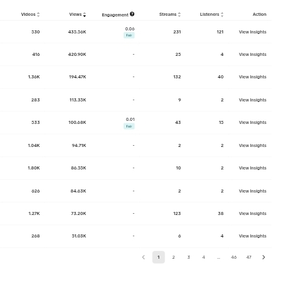
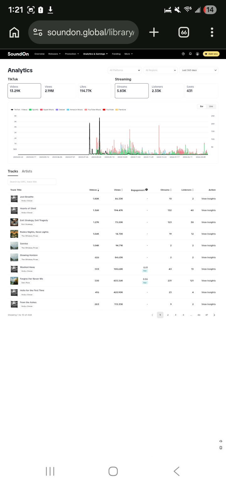

# AI Music Money Blueprint

## How to Turn Suno Songs Into Real Monthly Income Using SoundOn

---

## Read This First

I'm not a record label. I'm not a famous artist.

I'm just someone who tested this system at scale.

- Hundreds of songs uploaded
- Multiple "artists" running at once
- ~$20/month with zero promotion
- And yes... I got blocked once

Which is exactly why this guide exists — so you don't make the same mistakes.

---

## What This Guide Will Do

By the end of this, you will know:

- How to create songs with AI (fast)
- How to upload them to streaming platforms
- How to avoid getting banned
- How to scale into multiple artists
- How to turn this into real income

---

## STEP 1: Get Set Up (DO THIS FIRST)

### Sign Up for SoundOn

This is your distribution engine. SoundOn puts your music on:

- Spotify
- Apple Music
- TikTok
- Instagram

> **Important:** Approval can take time. While you wait — start creating music immediately.

---

## STEP 2: Create Songs FAST (Don't Overthink This)

Use AI tools like **Suno** to generate songs.

### Which Suno Tier?

**Free or Pro ($10/mo) is fine.** You can make over a hundred songs with the Pro model in a month. Premier ($30/mo) is nice but not necessary to start.

### Simple vs Custom Mode

Use **Custom mode** for full control. This is where you enter your own lyrics and style tags.

> *The Suno creation screen lets you enter lyrics, choose styles, and select the model version. Use Custom mode for best results.*

<!-- Add your own screenshot of the Suno custom creation screen here -->

### How to Write Prompts

In the **Lyrics** box, use structure tags:

```
[Verse]
Your verse lyrics here

[Chorus]
Your chorus lyrics here
```

**Only put in what you want sung.** If you like a generated sound, reuse that prompt.

In the **Styles** box, enter descriptive tags:

```
Emotional breakup song, slow tempo, female vocals, viral TikTok style
```

Or:

```
Dark cinematic villain arc, deep voice, powerful chorus
```

Keep it simple. Don't over-engineer.

### Hit Rate

You get a usable song almost **every time you generate.** They don't all have to sound great — **quantity over quality** at this stage.

---

### High-Performing Song Types

These genres consistently perform well because people use them in TikTok/Reels videos:

| Type | Why It Works |
|------|-------------|
| Sad / emotional songs | High relatability, gets shares |
| Relationship / breakup | Massive TikTok audience |
| "POV" style songs | Built for video content |
| Gym / motivation | Consistent niche demand |
| Dark / villain arc | Trending aesthetic |

---

## STEP 3: Create MULTIPLE ARTISTS (This Is Key)

This is where most people mess up. **Don't rely on one artist.**

### How Many Artists?

- **Start with:** 2–3 artists
- **Scale to:** 5–10 artists max

Too many = hard to manage. Too few = slow growth.

### One Account, Multiple Artists

Use **ONE SoundOn account** and create **multiple artists under it.**

Why?
- Easier management
- Lower risk vs juggling accounts
- Looks more legitimate

### Give Each Artist an Identity

Each artist needs at minimum:
- A name
- A genre
- A consistent vibe

| Artist | Style |
|--------|-------|
| Artist 1 | Sad emotional / female vocal |
| Artist 2 | Gym motivation / hype |
| Artist 3 | Dark cinematic / deep voice |

> **Bios and backstories are optional but help.** A simple name + genre identity is enough to start.

---

## STEP 4: DO NOT GET BANNED

I learned this the hard way.

### What Gets You Blocked

- Uploading too many songs at once
- Spamming bulk uploads
- No consistency, just dumping content
- Brand new account with instant bulk upload

### What Happened When I Got Flagged

- Upload access was restricted/blocked
- No clear warning beforehand
- Likely triggered by bulk behavior
- Couldn't upload new tracks — account basically "frozen"

**Recovery:**
- Waited it out
- Slowed down behavior after
- Avoided repeating patterns

> **Prevention > Recovery.** This isn't always recoverable quickly.

### Safe Upload Strategy

**Per artist, per week:**

| Strategy | Cadence |
|----------|---------|
| Album approach | 1 album per week, 8–12 songs per album |
| Singles approach | 1–2 singles every 2–3 days |
| Safe weekly range | 8–15 songs per artist |

**Ramp-up schedule for new accounts:**

| Week | Upload Volume |
|------|--------------|
| Week 1 | Light — 1–3 songs total |
| Week 2+ | Ramp to full album schedule |

> **Slow = sustainable.** Stay consistent, not explosive.

### Vocal vs Instrumental Ratio

Instrumental/lofi gets flagged more often.

**Recommended ratio:**
- 70–80% vocal tracks
- 20–30% instrumental

Instrumentals trigger higher spam/AI suspicion. Vocals are perceived as "real artist" content.

---

## STEP 5: Upload to SoundOn

When your account is ready:

1. Upload your track
2. Add title + artist name
3. Add simple cover art (3000x3000 px, JPG or PNG)
4. Submit

### Songs Per Album

**Sweet spot: 8–12 songs**

Why:
- Looks like a real album
- Not suspicious
- Enough content to generate streams

### Cover Art (Simple Canva Workflow)

1. Open Canva
2. Create custom size: **3000 x 3000 px**
3. Add: background gradient + artist name + album title
4. Keep it clean — don't overdesign

> *Your SoundOn promo page lets you set up artist profiles, add social links, choose song previews, and customize your bio. Each artist gets their own page.*

<!-- Add your own screenshot of the SoundOn promo page here -->

---

## STEP 6: Titles Matter More Than Music

Think like **content**, not music.

### Good Titles

- "POV: You Finally Let Go"
- "Late Night Drive Alone"
- "No One Checks On You"

People click **emotions.**

---

## STEP 7: Promotion (This Is Where Money Grows)

Right now you can make money WITHOUT promotion... but promotion = scale.

### TikTok Strategy (Simple Version)

Post:
- Short clips of your song
- Add emotional text overlay

Examples:
- "POV: you gave them everything"
- "This song hurts more than it should"

### Content Loop

```
Make song → Upload → Post clip → Repeat
```

### TikTok Artist Verification

1. Upload music through SoundOn
2. Music gets distributed to TikTok
3. Apply for artist claim/profile

**Timeline:** 2–4 weeks. Easy process, just slow.

---

## STEP 8: How You Actually Get Paid

### Streaming Revenue

Spotify + Apple Music pay per stream. Here's what real earnings look like:

> *Monthly earnings from streaming platforms over 6 months. Revenue comes primarily from Spotify and Apple Music, with smaller amounts from TikTok, YouTube Music, and others. Typical range: $15–$20/month per account with no promotion.*



### TikTok Usage

If people use your sound → exposure increases → more streams.

### SoundOn Payment Schedule

- **Payout:** Monthly
- **Delay:** Usually 30–60 days behind actual streams
- **Threshold:** Low/accessible (not super high like some platforms)

---

## STEP 9: Scaling the System

Once something works:
- Make more of THAT style
- Expand to more artists
- Stay consistent

### Real Analytics — What Scale Looks Like

> *Analytics dashboard showing performance across multiple artists. TikTok videos, views, and streaming data across all platforms. This is what consistent uploading over several months produces.*



### Track-Level Performance

> *Individual track performance data showing videos created, views, streams, and listeners per song. Some songs significantly outperform others — double down on what works.*



> *Detailed track analytics showing the range of performance. Top tracks can generate hundreds of streams and thousands of TikTok videos.*



### If You Run Ads ($50/month)

| Scenario | Expected Return |
|----------|----------------|
| Conservative | 1.5x–2x (break-even to small profit) |
| Optimized | 2x–5x if content hits |

**But:** Ads only work if the song is good, the content is emotional, and the hook is strong. Ads amplify — they don't fix bad content.

---

## STEP 10: Metadata (Advanced Edge)

### What Metadata Needs Cleaning?

Suno files may include:
- Generation tags
- Internal metadata markers
- Possible AI indicators (similar to EXIF data, but for audio)

### Is This Required?

- **Low volume users:** Probably fine without cleaning
- **Scaling users:** Safer to clean metadata

> Not required, but recommended for scaling safely.

---

## Reality Check

This is **NOT** instant money.

But it IS:
- Scalable
- Repeatable
- Low effort once the system is built

### Total Earnings Estimate

At ~$15–$20/month over 6 months = roughly **$90–$120 total.**

Consistency starts showing results after **2–3 months** as platforms index your music and songs stack over time.

---

## 30-DAY PLAN

### Week 1
- [ ] Sign up for SoundOn
- [ ] Start making songs daily on Suno
- [ ] Create 2–3 artist identities (name + genre + vibe)

### Week 2
- [ ] Continue making songs
- [ ] Build 1 album (8–12 songs) per artist
- [ ] Prepare uploads

### Week 3
- [ ] Start uploading (slowly — follow the ramp-up schedule)
- [ ] Begin TikTok posting with clips

### Week 4
- [ ] Track what works (check your analytics)
- [ ] Double down on winning styles
- [ ] Add more content

---

## BONUS: 10 Viral Song Ideas

1. POV: You finally move on
2. POV: They regret losing you
3. Gym: No excuses
4. Late night drive alone
5. You were never enough
6. Villain arc begins
7. Silent heartbreak
8. Trust broken
9. Alone but healing
10. They chose someone else

---

## The Real Secret

Most people fail because:
- They overcomplicate the music
- They don't stay consistent
- They never scale

**You don't need talent. You need volume + consistency + strategy.**

I made money doing this with no promotion and no audience.

If you actually push this... you'll outperform me fast.

---

## Next Step

**Start TODAY.** Not next week. Not when it's perfect.

Make your first 5 songs and go.
