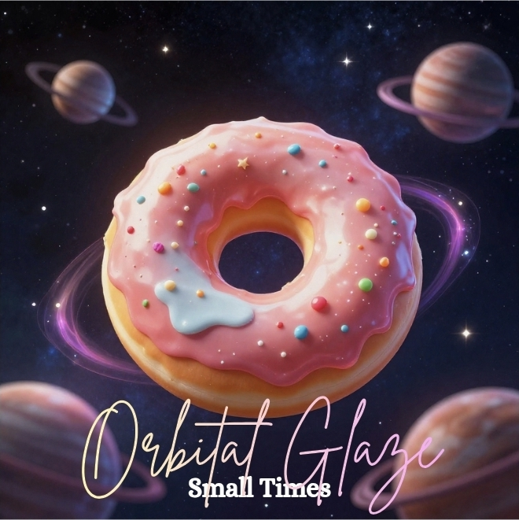
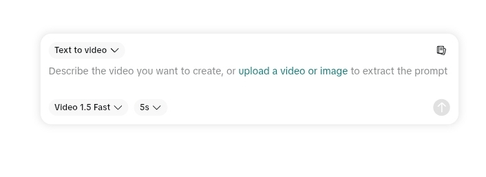
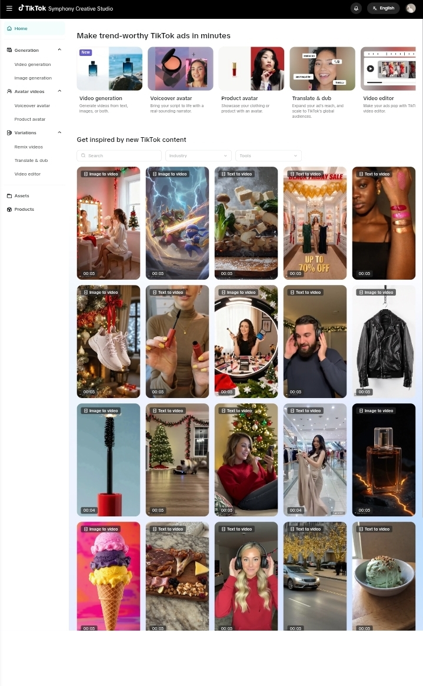
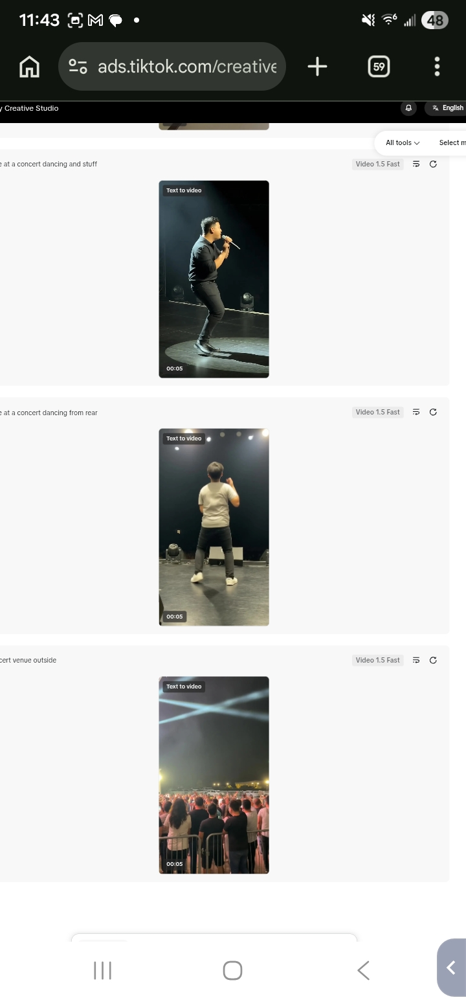
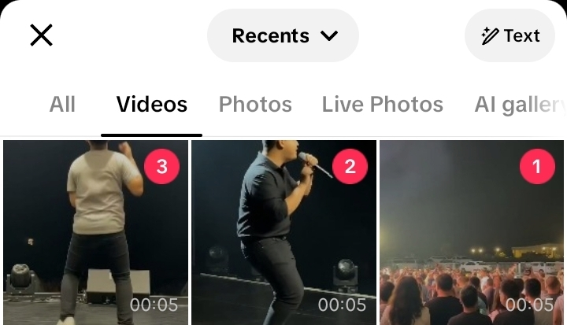
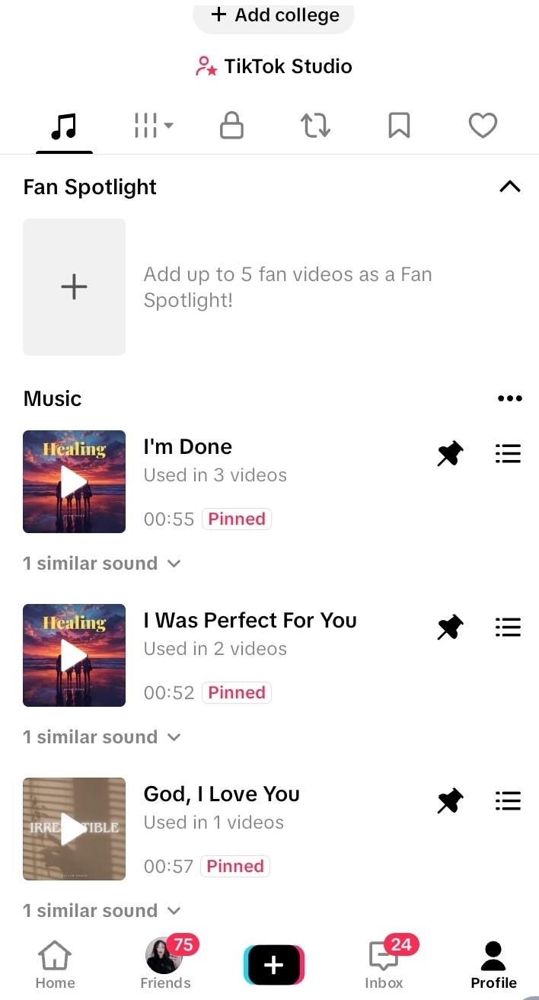
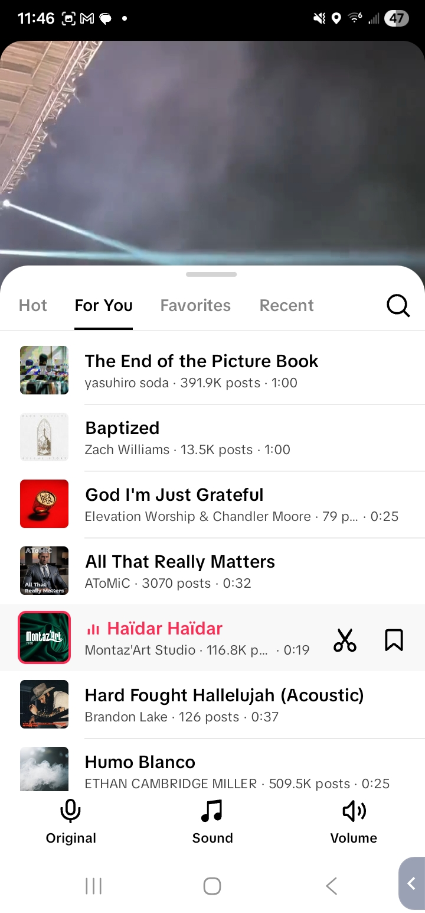

# AI Music Money Blueprint

## How to Turn Suno Songs Into Real Monthly Income Using SoundOn

---

## Read This First

I'm not a record label. I'm not a famous artist.

I'm just someone who tested this system at scale.

- Hundreds of songs uploaded
- Multiple "artists" running at once
- ~$20/month with zero promotion
- And yes... I got blocked once

Which is exactly why this guide exists — so you don't make the same mistakes.

---

## What This Guide Will Do

By the end of this, you will know:

- How to create songs with AI (fast)
- How to write lyrics using AI tools
- How to upload them to streaming platforms
- How to avoid getting banned
- How to scale into multiple artists
- How to promote on TikTok, Instagram, YouTube, and Reddit
- How to create free promo videos with no editing skills
- How to handle copyright and legal basics
- How to turn this into real income

---

## STEP 1: Get Set Up (DO THIS FIRST)

### Sign Up for SoundOn

This is your distribution engine. SoundOn puts your music on:

- Spotify
- Apple Music
- TikTok
- Instagram
- YouTube Music
- Amazon Music
- Deezer
- And more

> **Important:** Approval can take time. While you wait — start creating music immediately.

### Set Up Spotify for Artists

Once your first song goes live on Spotify:

1. Go to **artists.spotify.com** and claim your artist profile
2. Add a bio, profile photo, and header image
3. Use the **"Upcoming Release"** feature to pitch songs to Spotify's editorial playlists (do this at least 7 days before release)
4. Check your analytics weekly — see which songs get saves, which playlists you land on

> **Why this matters:** Spotify's algorithm recommends music based on saves, playlist adds, and listen-through rate. Claiming your profile and pitching releases is free and can land you on algorithmic playlists like Discover Weekly and Release Radar.

### Alternative Distributors

SoundOn is the recommendation, but if you have issues, these also work:

| Distributor | Cost | Notes |
|------------|------|-------|
| SoundOn | Free | Best for TikTok integration |
| DistroKid | $22.99/year | Unlimited uploads, fast delivery |
| TuneCore | $9.99/single | Per-release pricing |
| Amuse | Free tier | Slower delivery, limited features |

> Stick with SoundOn unless you have a specific reason to switch. The TikTok integration alone makes it worth it.

---

## STEP 2: Create Songs FAST (Don't Overthink This)

Use AI tools like **Suno** to generate songs.

### Which Suno Tier?

**Free or Pro ($10/mo) is fine.** You can make over a hundred songs with the Pro model in a month. Premier ($30/mo) is nice but not necessary to start.

### Simple vs Custom Mode

Use **Custom mode** for full control. This is where you enter your own lyrics and style tags.

> *The Suno creation screen lets you enter lyrics, choose styles, and select the model version. Use Custom mode for best results.*

<!-- TODO: Add screenshot of the Suno custom creation screen (Advanced mode with Lyrics + Styles boxes) -->

### How to Write Prompts

In the **Lyrics** box, use structure tags:

```
[Verse]
Your verse lyrics here

[Chorus]
Your chorus lyrics here
```

**Only put in what you want sung.** If you like a generated sound, reuse that prompt.

In the **Styles** box, enter descriptive tags:

```
Emotional breakup song, slow tempo, female vocals, viral TikTok style
```

Or:

```
Dark cinematic villain arc, deep voice, powerful chorus
```

Keep it simple. Don't over-engineer.

### Using AI to Write Better Lyrics

Don't write lyrics from scratch — use AI to help:

1. **ChatGPT or Claude:** Ask it to write lyrics in a specific style. Example prompt: *"Write a 2-verse, 1-chorus emotional breakup song. Female perspective. Short lines. Made for TikTok."*
2. **Iterate:** If the first draft is close, ask it to revise specific lines
3. **Steal structures:** Find songs you like, feed the structure (not the words) to AI and ask for new lyrics in that format

> **Pro tip:** Ask AI to write lyrics with a strong "hook line" in the first 5 seconds. That's what makes people stop scrolling on TikTok.

### Song Length

- **Ideal length: 2–3 minutes.** Streaming platforms count a "stream" after ~30 seconds of listening. Shorter songs = more replays = more streams.
- **For TikTok clips:** The hook needs to hit in the first 10–15 seconds. Front-load the emotion.
- **Suno tip:** If a song generates at 4+ minutes, you can use the "Extend" feature to create shorter versions, or just trim in any free audio editor (Audacity, CapCut).

### Hit Rate

You get a usable song almost **every time you generate.** They don't all have to sound great — **quantity over quality** at this stage.

---

### High-Performing Song Types

These genres consistently perform well because people use them in TikTok/Reels videos:

| Type | Why It Works |
|------|-------------|
| Sad / emotional songs | High relatability, gets shares |
| Relationship / breakup | Massive TikTok audience |
| "POV" style songs | Built for video content |
| Gym / motivation | Consistent niche demand |
| Dark / villain arc | Trending aesthetic |

---

## STEP 3: Create MULTIPLE ARTISTS (This Is Key)

This is where most people mess up. **Don't rely on one artist.**

### How Many Artists?

- **Start with:** 2–3 artists
- **Scale to:** 5–10 artists max

Too many = hard to manage. Too few = slow growth.

### One Account, Multiple Artists

Use **ONE SoundOn account** and create **multiple artists under it.**

Why?
- Easier management
- Lower risk vs juggling accounts
- Looks more legitimate

### Give Each Artist an Identity

Each artist needs at minimum:
- A name
- A genre
- A consistent vibe

| Artist | Style |
|--------|-------|
| Artist 1 | Sad emotional / female vocal |
| Artist 2 | Gym motivation / hype |
| Artist 3 | Dark cinematic / deep voice |

> **Bios and backstories are optional but help.** A simple name + genre identity is enough to start.

### Naming Your Artists

Tips for choosing artist names:
- **Google the name first** — make sure no real artist already uses it. Duplicate names cause confusion on Spotify/Apple Music and can get your profile merged or flagged.
- **Keep it short and memorable** — 1–2 words max
- **Match the vibe** — a dark cinematic artist shouldn't be named "Sunny Days"
- **Avoid special characters** — stick to letters. Makes it easier to search and share.
- **Check Spotify/Apple Music** — search the name before you commit. If it's taken, pick something else.

---

## STEP 4: DO NOT GET BANNED

I learned this the hard way.

### What Gets You Blocked

- Uploading too many songs at once
- Spamming bulk uploads
- No consistency, just dumping content
- Brand new account with instant bulk upload

### What Happened When I Got Flagged

- Upload access was restricted/blocked
- No clear warning beforehand
- Likely triggered by bulk behavior
- Couldn't upload new tracks — account basically "frozen"

**Recovery:**
- Waited it out
- Slowed down behavior after
- Avoided repeating patterns

> **Prevention > Recovery.** This isn't always recoverable quickly.

### Safe Upload Strategy

**Per artist, per week:**

| Strategy | Cadence |
|----------|---------|
| Album approach | 1 album per week, 8–12 songs per album |
| Singles approach | 1–2 singles every 2–3 days |
| Safe weekly range | 8–15 songs per artist |

**Ramp-up schedule for new accounts:**

| Week | Upload Volume |
|------|--------------|
| Week 1 | Light — 1–3 songs total |
| Week 2+ | Ramp to full album schedule |

> **Slow = sustainable.** Stay consistent, not explosive.

### Vocal vs Instrumental Ratio

Instrumental/lofi gets flagged more often.

**Recommended ratio:**
- 70–80% vocal tracks
- 20–30% instrumental

Instrumentals trigger higher spam/AI suspicion. Vocals are perceived as "real artist" content.

---

## STEP 5: Upload to SoundOn

When your account is ready:

1. Upload your track
2. Add title + artist name
3. Add simple cover art (3000x3000 px, JPG or PNG)
4. Submit

### Songs Per Album

**Sweet spot: 8–12 songs**

Why:
- Looks like a real album
- Not suspicious
- Enough content to generate streams

### Cover Art (Canva AI Workflow)

Canva has a built-in **AI image generator** — you don't need Midjourney or DALL-E for cover art.

> *Example cover art created with AI — "Orbital Glaze: Small Times". A simple AI-generated image with artist name and album title in matching fonts.*



**Step-by-step:**

1. Open Canva → Create custom size: **3000 x 3000 px**
2. Go to **Elements** → type a prompt in the search bar → click **Generate**
3. Canva's AI will create images based on your prompt (example: "a donut in space", "neon city at night", "abstract smoke and fire")
4. Pick the one you like and place it as your background
5. Go to **Text** → choose a font that matches your artist's vibe
6. Add your **artist name** in a stylish font (script fonts work great for emotional/indie artists, bold sans-serif for hype/gym artists)
7. Add the **album name** underneath in a smaller, cleaner font
8. Download as PNG

**Tips:**
- Match the art style to the genre — dark moody art for dark artists, bright/colorful for pop
- Keep text readable — don't let it blend into the background
- Use the same font/color scheme across all albums for one artist to build brand consistency
- Canva's free tier includes the AI generator — no need to pay

> *Your SoundOn promo page lets you set up artist profiles, add social links, choose song previews, and customize your bio. Each artist gets their own page.*

<!-- TODO: Add screenshots of SoundOn promo page, artist profile setup, and release details -->

---

## STEP 6: Titles Matter More Than Music

Think like **content**, not music.

### Good Titles

- "POV: You Finally Let Go"
- "Late Night Drive Alone"
- "No One Checks On You"

People click **emotions.**

### Best Days and Times to Release

- **Release day:** Friday. This is industry standard — Spotify's New Music Friday playlists update on Fridays, and Release Radar populates over the weekend.
- **Upload to SoundOn:** At least 7–14 days before your target release date. Distribution takes time.
- **Posting content:** Tuesday–Thursday evenings (6–9 PM in your target audience's timezone) tend to get the best TikTok/Instagram engagement.

### Hashtag Strategy

When posting clips on TikTok/Instagram, use hashtags that match the emotion, not the music industry:

**Good hashtags:**
- #pov #relatable #fyp #viral #emotionaltiktok #latenightthoughts #sadtiktok #healing #movingon #villain

**Bad hashtags:**
- #newmusic #indieartist #spotifyplaylist #unsigned (these are oversaturated and mostly used by other artists, not listeners)

> **The goal:** Get in front of people who FEEL things, not people who make music.

---

## STEP 7: Promotion (This Is Where Money Grows)

Right now you can make money WITHOUT promotion... but promotion = scale.

### TikTok Strategy (Simple Version)

Post:
- Short clips of your song
- Add emotional text overlay

Examples:
- "POV: you gave them everything"
- "This song hurts more than it should"

### Content Loop

```
Make song → Upload → Post clip → Repeat
```

### Free Video Creation (No Editing Skills Needed)

TikTok offers a **free video creation tool** through their Creative Studio:

**[TikTok Creative Studio — Text/Image to Video](https://ads.tiktok.com/creative/creativestudio/image-to-video?subApp=CreativeStudio/MiniApp/TextToVideo)**

How to use it:
1. Create a free TikTok Ads account (you don't need to run ads)
2. Go to Creative Studio → Image/Text to Video
3. Upload an image or enter a text prompt
4. Generate a professional-looking video for free
5. Download and add your song as background audio

> *The TikTok Creative Studio text-to-video prompt — just describe the video you want and it generates it for free.*



> *Browse templates and trending styles for inspiration before creating your own.*



> *AI-generated concert videos from a simple text prompt — no editing skills needed.*



**Where to post these videos:**
- TikTok
- Instagram Reels
- Facebook Reels
- Reddit

> *Select your AI-generated videos from your camera roll and post directly to TikTok.*



This is a game-changer if you don't have video editing skills. You get professional content for free that you can pair with your music.

### Setting Up Your SoundOn Promo Page

Your SoundOn promo page is how people find your artist on streaming platforms. **This is critical for promotion.**

1. Go to your SoundOn dashboard → Artist Profile
2. Add your artist bio, profile photo, and social links
3. Choose which songs to feature as previews
4. Copy your promo page link

**How to use your promo link:**
- Put it in your TikTok bio
- Share it in Instagram stories
- Add it to your Reddit posts
- Include it in any social media promotion

When people click your promo link, they can choose their preferred streaming platform (Spotify, Apple Music, etc.) to listen to your music. This is your main conversion tool — every piece of content you post should drive people back to this link.

### Setting Up Your Sound on TikTok

Once SoundOn distributes your music to TikTok:

1. Your song becomes available as a "sound" on TikTok
2. Go to your TikTok profile → claim your artist page
3. Your sounds will be linked to your profile
4. When you post videos, use YOUR OWN sound as the audio
5. When others use your sound → more streams → more money

> *Your pinned sounds in TikTok Studio — showing songs distributed through SoundOn that are now available as TikTok sounds. Pin your best songs so they appear first on your profile.*



> *The TikTok sound browser — this is where users discover trending sounds. Getting your song used in videos puts it in front of more people.*



> **Tip:** In every TikTok video caption, tell people to "use this sound" — this encourages others to create videos with your music, which drives streams.

### Instagram Reels Strategy

Don't sleep on Instagram — it works the same way as TikTok:

1. Create a Reel using your song as background audio
2. Use the same emotional text overlay formula
3. Post consistently (3–5 Reels per week minimum)
4. Use Instagram's "Collab" feature to cross-promote between your artist accounts

> **Instagram advantage:** Reels get pushed to non-followers via the Explore page. And Instagram users tend to be older with more spending power (they're more likely to stream on Spotify/Apple Music).

### YouTube Shorts

YouTube Shorts is an underused channel for AI music promotion:

1. Create 15–60 second vertical videos with your song
2. Upload as a YouTube Short
3. Add your song title and artist name in the description
4. Link to your Spotify/Apple Music in your channel bio

YouTube Music streams also generate royalties through SoundOn. Every Short that uses your audio is free promotion.

### Reddit Promotion

Subreddits like r/PlaylistsSpotify, r/IndieMusicFeedback, and niche genre subs can drive real streams:

- **Don't spam.** Engage genuinely in the community first.
- Post your music with context ("just dropped this, looking for feedback")
- Some subreddits have weekly self-promotion threads — use those

### TikTok Artist Verification

1. Upload music through SoundOn
2. Music gets distributed to TikTok
3. Apply for artist claim/profile

**Timeline:** 2–4 weeks. Easy process, just slow.

---

## STEP 8: How You Actually Get Paid

### Streaming Revenue

Spotify + Apple Music pay per stream. Here's what real earnings look like:

> *Monthly earnings from streaming platforms over 6 months. Revenue comes primarily from Spotify and Apple Music, with smaller amounts from TikTok, YouTube Music, and others. Typical range: $15–$20/month per account with no promotion.*


### TikTok Usage

If people use your sound → exposure increases → more streams.

### SoundOn Payment Schedule

- **Payout:** Monthly
- **Delay:** Usually 30–60 days behind actual streams
- **Threshold:** Low/accessible (not super high like some platforms)

---

## STEP 9: Scaling the System

Once something works:
- Make more of THAT style
- Expand to more artists
- Stay consistent

### Real Analytics — What Scale Looks Like

> *Analytics dashboard showing performance across multiple artists. TikTok videos, views, and streaming data across all platforms. This is what consistent uploading over several months produces.*


### Track-Level Performance

> *Individual track performance data showing videos created, views, streams, and listeners per song. Some songs significantly outperform others — double down on what works.*


> *Detailed track analytics showing the range of performance. Top tracks can generate hundreds of streams and thousands of TikTok videos.*


### If You Run Ads ($50/month)

| Scenario | Expected Return |
|----------|----------------|
| Conservative | 1.5x–2x (break-even to small profit) |
| Optimized | 2x–5x if content hits |

**But:** Ads only work if the song is good, the content is emotional, and the hook is strong. Ads amplify — they don't fix bad content.

---

## STEP 10: Legal and Copyright (Know the Rules)

### AI Music Copyright — Where Things Stand

- **Suno Pro/Premier plans** grant you commercial rights to the music you generate. The free tier does NOT — it's for personal use only.
- **Lyrics you write** (or have AI write for you) are your input. The melody and production are AI-generated.
- Copyright law around AI music is still evolving. As of now, most platforms accept AI-generated music without issue.
- **Do NOT claim you wrote/produced the music yourself** in official copyright registrations. Be honest in metadata — just don't volunteer "this is AI" either.

### What NOT to Do

- **Don't copy existing songs.** If your AI output sounds too similar to a real song, skip it. Content ID systems on YouTube/Spotify can flag it.
- **Don't use real artist names** in your Suno prompts. This can produce output that's too close to the original and risks takedowns.
- **Don't upload the same song under multiple artists.** Platforms detect duplicate audio and will flag or remove it.
- **Don't use copyrighted images** for cover art. Use AI-generated art (Canva AI, DALL-E, Midjourney) or royalty-free images.

### If You Get a Copyright Claim

- Don't panic. Review the claim — sometimes they're automated and wrong.
- If it's legit (your song sounds too close to something), pull the track and replace it.
- If it's false, dispute it through the platform (Spotify for Artists, YouTube Studio, etc.)

---

## STEP 11: Metadata (Advanced Edge)

### What Metadata Needs Cleaning?

Suno files may include:
- Generation tags
- Internal metadata markers
- Possible AI indicators (similar to EXIF data, but for audio)

### Is This Required?

- **Low volume users:** Probably fine without cleaning
- **Scaling users:** Safer to clean metadata

> Not required, but recommended for scaling safely.

---

## Reality Check

This is **NOT** instant money.

But it IS:
- Scalable
- Repeatable
- Low effort once the system is built

### Total Earnings Estimate

At ~$15–$20/month over 6 months = roughly **$90–$120 total.**

Consistency starts showing results after **2–3 months** as platforms index your music and songs stack over time.

---

## 30-DAY PLAN

### Week 1
- [ ] Sign up for SoundOn
- [ ] Sign up for Suno (free or Pro)
- [ ] Start making songs daily — aim for 5–10 per day
- [ ] Create 2–3 artist identities (name + genre + vibe)
- [ ] Google your artist names to make sure they're unique
- [ ] Set up Canva for cover art

### Week 2
- [ ] Continue making songs — save your best ones
- [ ] Build 1 album (8–12 songs) per artist
- [ ] Create cover art for each album
- [ ] Clean metadata on all tracks
- [ ] Prepare uploads (titles, descriptions, art)

### Week 3
- [ ] Start uploading (slowly — follow the ramp-up schedule)
- [ ] Claim your Spotify for Artists profile once first songs are live
- [ ] Set up your SoundOn promo page for each artist
- [ ] Create a TikTok account and start posting clips
- [ ] Post 1–2 Reels on Instagram per artist

### Week 4
- [ ] Track what works (check Spotify for Artists + SoundOn analytics)
- [ ] Double down on winning styles
- [ ] Add more content — aim for 1 album per artist per week
- [ ] Set up YouTube Shorts if you have bandwidth
- [ ] Pitch your next release to Spotify editorial playlists (7+ days before release)
- [ ] Start planning your second month's content calendar

---

## When a Song Blows Up (What to Do)

If one of your songs starts getting traction (100+ streams/day, TikTok videos using your sound, playlist adds):

1. **Double down immediately.** Make more songs in that EXACT style. Same genre, same vibe, same prompt structure.
2. **Release a follow-up within 1 week.** Capitalize on the momentum while the algorithm is pushing you.
3. **Post more content with that song.** 2–3 TikToks/Reels per day using that specific track.
4. **Check where streams are coming from** in Spotify for Artists. If it's a playlist, note which one — try to land similar songs on the same playlist.
5. **Consider running ads** ($5–$10/day on TikTok) specifically for that song while it has momentum.
6. **Don't change what's working.** This isn't the time to experiment with new genres.

> A single viral song can generate months of passive income. One hit pays for everything.

---

## BONUS: 10 Viral Song Ideas

1. POV: You finally move on
2. POV: They regret losing you
3. Gym: No excuses
4. Late night drive alone
5. You were never enough
6. Villain arc begins
7. Silent heartbreak
8. Trust broken
9. Alone but healing
10. They chose someone else

---

## The Real Secret

Most people fail because:
- They overcomplicate the music
- They don't stay consistent
- They never scale

**You don't need talent. You need volume + consistency + strategy.**

I made money doing this with no promotion and no audience.

If you actually push this... you'll outperform me fast.

---

## Companion Tools Site

Check out our **[AI Music Tools & Artist Prompts](https://phil08533.github.io/SunoGuide/)** page for:
- 100 artist sound-alike prompts for Suno (copy-paste ready)
- AI tools directory
- In-browser metadata cleaner
- Free video creation guide
- And more

---

## Next Step

**Start TODAY.** Not next week. Not when it's perfect.

Make your first 5 songs and go.
